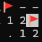
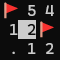

# cs20200-term-project

# Overview
This project is a console-based Minesweeper game made with F#. The player will find the mines using keyboard. 
There are two modes, basic and harder. In basic, the size of the board and the number of mines are fixed. Basic easy has 10 mines in 10*10 size board, and basic hard has 40 mines in 16*16 board. In harder, you can custom the size of board and number of mines. The maximum size would be 30*24, and there can be up to width * height - 10. A mine density of around 20-25% might give you a fun game. Also, you might guess the mines to solve the problem. 100% solvable board is only implemented in Basic boards. There will be no mines at the initial place you start, so you can start safe and have clues to use.

# How to Play
1. Start : Type "start dotnet run" on your terminal. There will open a new terminal window, and the game will start. If you are using Mac/Linux, type "dotnet run". 
2. Menu : You can select the menus using arrows and Spacebar. When you enter Harder!, type the size and press enter. 
3. Playing : After making the board, you can start the game. 
    - '-' : Closes Cell
    - '.' : Empty Cell(No mines nearby)
    - Number (n) : There are n mines between adjacent 8 cells
    You can move your cursor with arrows. If you press space, the initial cell will open and you can start from there. 

    Controls 
    **1) Arrows**
    You can move your cursor with arrows.

    **2) F(Flag)**
    When you press F, the flag will be placed. If you press F to already flagged cell, then it will unflag.

    **3) Spacebar** : There are two functions in Spacebar.

        (1) Opening : When you press spacebar to closed cell, it will open. If you open wrong cell, it will be gameover.

        (2) Chording: There is a function called chording, which helps to clear the game much more faster. If you press spacebar on already opened cell, and if that cell satisfies the number of flags nearby, it will automatically open all the closed cell. If you flagged wrong flags and use chording, that will also be gameover so be careful. 
        
        For example, when you find 2 mines in below image and press spacebar at '2', then the upper two cells will open.

         will change into 

    **4) Backspace(delete key in Mac)** 
    If you want to start a new game, press backspace. You can start from selecting modes.
4. Finish : If you open all the number cells without opening mine, you win and the game will be finished. If you open mine, that will be gameover. You can either start a new game by pressing 'Y' or exit by pressing 'N'.

## Font Problem
Maybe the emojis of mine and flag can broke to 'ㅁ' or '??'. This project used UTF-8 encoding for modern emoji rendering. If your console displays broken characters, it means your current terminal's font does not support these emojis.

**Solution 1: Use Windows Terminal (Recommended)**
The standard Windows Command Prompt (`cmd.exe`) uses legacy text rendering. Please use **Windows Terminal** (default in Windows 11, or downloadable from the Microsoft Store). It fully supports UTF-8 and emoji rendering natively.

**Solution 2: Change the Terminal Font**
If you want to use the classic `cmd.exe` or `PowerShell`:
1. Right-click on the title bar of the terminal window and select "Properties".
2. Go to the "Font" tab.
3. Change the font to "Cascadia Code", "Cascadia Mono", or "Consolas" (fonts that support extended character sets).
4. Click "OK" and restart the game.
    